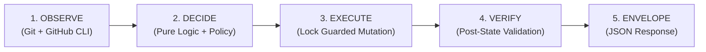

# `gw` — GitHub-Aware Deterministic Git Workflow Engine

[](https://github.com/gitskill/gw/actions/workflows/ci.yml)
[](LICENSE)
[](go.mod)

<!-- demo: pr-status comparison, heavier task setup -->

**`gw`** is a deterministic, token-efficient Git and GitHub workflow engine designed for multi-model AI coding agents (Antigravity, Gemini CLI, Claude Code, Cursor, Codex, etc.) and developer tooling.

Instead of issuing sequences of raw, verbose, and unpredictable shell commands (`git status`, `git add`, `git commit`, `git push`, `gh pr create`, `gh pr checks`), AI agents invoke `gw` as a unified skill. `gw` observes repository state, computes deterministic decisions in pure code, executes guarded mutations, and returns compact JSON envelopes.

---

## 🚀 Key Highlights & Architectural Advantages

- **⚡ Token-Efficient (~80% Reduction):** Replaces verbose terminal dumps with single-call, schema-validated JSON envelopes.
- **🛡️ Safe-by-Default Policy Engine:** Disallows accidental commits, unauthorized pushes to base branches, and unapproved merges out-of-the-box.
- **🔒 Two-Factor Merge Safety:** Merging a PR requires both recorded GitHub code review approval (`APPROVED`) and explicit confirmation (`--yes`).
- **✋ Confirmation Gate on Mutations:** `prepare`, `push`, and `sync` each require explicit confirmation (`--yes`) by default (`*.require_confirmation`), enforced in the decision layer — not just prompted for by the calling agent.
- **🛑 Mutex Concurrency Guard:** Mutating operations acquire `.git/gw.lock` with automatic PID-liveness and age-based stale lock reclamation.
- **🛡️ Untrusted Repo Boundary:** Repo-local `.gw.yml` files are ignored by default unless explicitly enabled via `--allow-repo-config`.
- **🔑 Credential Redaction:** Automatic defense-in-depth sanitization of GitHub PATs, OAuth tokens, and Authorization headers in all logs and error streams.
- **🤖 Universal AI Skill Integration:** Out-of-the-box skills for Antigravity, Gemini, Claude, and OpenAI harnesses.

---

## 🔄 The `gw` Workflow Lifecycle

Every mutating workflow executes a strict, 4-phase lifecycle:



1. **OBSERVE:** Gathers unified Git status and GitHub PR/checks metadata via single-call GraphQL batching with in-process read caching.
2. **DECIDE:** Evaluates preconditions against user policy via pure, side-effect-free decision functions.
3. **EXECUTE:** Executes minimal necessary mutation while holding `.git/gw.lock`.
4. **VERIFY:** Re-observes the repository to prove the mutation succeeded before reporting `SUCCESS`.
5. **ENVELOPE:** Emits a structured JSON envelope with actionable `status`, `code`, `reason`, and `next_action`.

---

## 📋 Key Workflow Protocol for AI Agents

When integrated into coding harnesses, agents follow this strict protocol:

1. **Auto-Invocation:** The agent invokes `gw` whenever it needs to inspect, stage, commit, push, sync, create PRs, check CI, or merge.
2. **User Transparency Gate:**
   - **Read-Only Commands** (`inspect`, `pr-ready`, `pr-status`, `doctor`): Executed immediately.
   - **Mutating Commands** (`prepare`, `push`, `sync`, `pr-create`, `pr-merge`): **The agent must list planned operations (branch, files, PR title, merge method) and obtain user confirmation before executing.**
3. **Deterministic Envelope Handling:**
   - On `SUCCESS` / `NOOP`, the agent continues work using `data`.
   - On non-success (`ACTION_REQUIRED`, `BLOCKED`, `CONFLICT`, `WAIT`, `POLICY_DENIED`, `HUMAN_APPROVAL_REQUIRED`), the agent reports `reason` and follows `next_action` rather than improvising raw commands.

---

## 🛠️ Supported Workflows

| Command | Type | Description |
|---|---|---|
| `gw inspect` | Read-only | Observes and normalizes current Git repository and GitHub PR state. |
| `gw prepare` | Mutating (Gated) | Stages and commits changes if `commit.allow: true` and `--message` is provided. |
| `gw push` | Mutating | Pushes branch to remote with `--set-upstream` tracking if needed. |
| `gw sync` | Mutating | Fast-forward only synchronization (`git merge --ff-only`) with upstream. |
| `gw pr-ready` | Read-only | Evaluates branch readiness for pull request creation in fixed precedence. |
| `gw pr-create` | Mutating | Creates a pull request after verifying pushed state and clean working tree. |
| `gw pr-status` | Read-only | Retrieves normalized PR mergeability, CI status rollup, and review state. |
| `gw pr-merge` | Mutating (Guarded) | Merges PR after verifying 2FA (GitHub approval + `--yes`) and passing CI checks. |
| `gw doctor` | Diagnostic | Validates system environment (`git`, `gh`, authentication status). |

---

## 📦 JSON Envelope Contract

All commands support `--json` output formatted according to schema version `1`:

```json
{
  "schema_version": 1,
  "status": "SUCCESS",
  "code": "PR_CREATED",
  "action": "CREATE_PR",
  "reason": "Working tree clean, branch pushed, no existing PR.",
  "next_action": null,
  "data": {
    "pr": {
      "number": 142,
      "url": "https://github.com/owner/repo/pull/142"
    }
  },
  "retry_after_hint": null,
  "debug": null
}
```

### Status Taxonomy & Exit Codes

| Status | Process Exit Code | Meaning |
|---|---|---|
| `SUCCESS` | `0` | Action completed and post-mutation state verified. |
| `NOOP` | `0` | Repository is already in the desired state (e.g. already pushed, already merged). |
| `WAIT` | `0` | Asynchronous operation in progress (CI checks running); check `retry_after_hint`. |
| `ACTION_REQUIRED` | `1` | Caller intervention required (e.g. unpushed commits, uncommitted changes). |
| `BLOCKED` | `1` | Precondition failed (e.g. dirty working tree, detached HEAD, repo locked). |
| `AUTH_REQUIRED` | `1` | GitHub CLI unauthenticated or insufficient token scopes. |
| `CONFLICT` | `1` | Git divergence or PR merge conflicts detected; manual resolution needed. |
| `POLICY_DENIED` | `1` | Operation forbidden by configured policy. |
| `HUMAN_APPROVAL_REQUIRED` | `1` | High-risk mutation requires reviewer approval or `--yes` confirmation. |
| `VALIDATION_FAILED` | `1` or `2` | Flag usage error (`2`) or environment unsupported (`1`). |
| `COMMAND_FAILED` | `1` | Internal binary execution failed. |
| `VERIFICATION_FAILED` | `1` | Post-mutation verification check did not match expected outcome. |

---

## ⚙️ Configuration

Policy is configured in `~/.config/gw/config.yaml` or via CLI flags:

```yaml
version: 1
base_branch: main

commit:
  allow: false                 # Disallows automated commits by default
  require_confirmation: true   # Requires explicit --yes before committing

push:
  allow: true                  # Allows push to feature branches
  allow_set_upstream: true     # Allows setting remote tracking branch
  require_confirmation: true   # Requires explicit --yes before pushing

pull_request:
  create: true
  draft: false

merge:
  allow: false                 # Merges disabled by default
  require_checks: true         # Blocks merge if CI checks fail/pending
  require_approval: true       # Requires GitHub review approval before merge

sync:
  strategy: ff-only            # Fast-forward only (no accidental merge commits)
  require_confirmation: true   # Requires explicit --yes before syncing

lock:
  stale_after: 10m             # Automatically reclaims locks older than 10 minutes
```

---

## 🤖 AI Skill Setup

`gw` includes standard skill definitions ready to be placed into your AI agent configuration directories:

- **Antigravity / Gemini CLI:** Copy `skill/git-workflow-engine/SKILL.md` to `.gemini/skills/git-workflow/SKILL.md`
- **Agent Frameworks:** Copy to `.agents/skills/git-workflow/SKILL.md`
- **Claude / Cursor / Codex:** Point harness context or tool index to `skill/git-workflow-engine/SKILL.md`

---

## 🏗️ Build & Installation

### Prerequisites
- [Go 1.22+](https://go.dev/dl/)
- [Git](https://git-scm.com/)
- [GitHub CLI (`gh`)](https://cli.github.com/)

### Build from Source
```bash
# Build binary
go build -trimpath -ldflags "-s -w" -o bin/gw ./cmd/gw

# Run test suite
go test ./... -v

# Run vendor neutrality lint
go test ./internal/vendorcheck/... -v

# Run integration tests (requires git)
go test ./test/integration/... -v
```

---

## 📄 License

This project is licensed under the [MIT License](LICENSE).